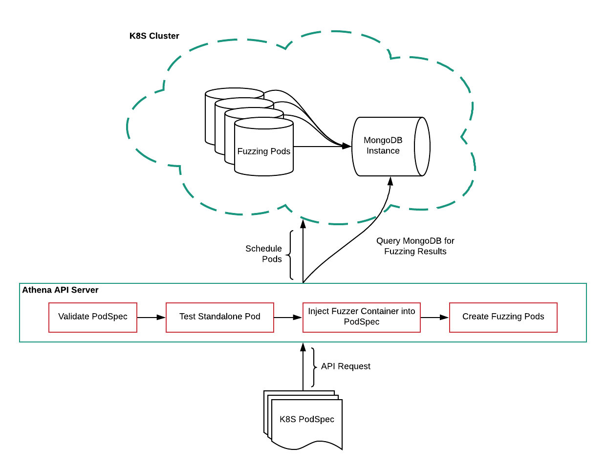
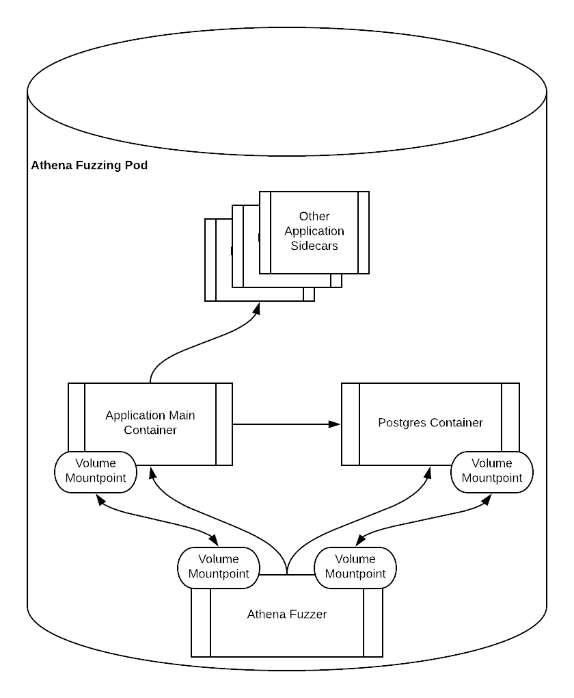

# Athena
Athena is a prototype web application fuzzer. It instruments the target application to collect metrics that inform parameter mutations, with the goal of detecting security violations. Currently, Athena identifies SQL injection and unhandled exceptions, flagging those that are potentially dangerous. Athena only runs against Rails targets, but in the future I expect to extend to Go and Java.

### Architecture
Athena relies on an OpenAPI spec (aka Swagger) to understand the endpoints that are exposed by the application, and create appropriate http requests that match the schema provided.  Specific swagger benefits include:
- Enumerating parameters.  This eliminates the step of parameter discovery because all parameters are known beforehand.
- Identifying parameter types.  In the case of an enum, all valid possibilities for an enum are provided.
- Providing sample valid parameter values.  In the absence of human generated data, this provides a good substitute for starting values for a paramter.

Web applications are rarely self contained in today's age of microservices. More often than not, they will require access to a database and possibly some other dependencies that they will talk to through either unix sockets or the TCP/IP stack. Athena leverages the kubernetes Pod concept to create a reproducible environment that captures this complexity. Specifically, the user must provide a pod spec with the uninstrumented target application, and any other sidecar containers.  The pod spec is submitted through a request to the Athena API server.  The Athena API server then does a series of passes to patch the pod and make it fuzzable, while also doing sanity checks to ensure nothing breaks.  I erred on the side of doing more passes rather than less.  In case something breaks, this provides more granularity and enables me to debug it much more quickly.
1) Validate the pod spec.
2) Run the pod uninstrumented and make sure it doesn't crash and stays healthy.  Ideally, they have provided liveness and readiness probes.
2) Inject the patched rails and run the pod.  Athena patches have only been made to Rail 5.2.1, which limits the applications we support to this version.  To be meticulous, this could be broken down into 2 phases: a) inject 5.2.1 and run the pod to make sure the target application works with rails 5.2.1 b) inject patched 5.2.1.  If anything breaks, this allows us to determine if it was due to the Rails version of the patches made.
3) Modify postgres so that it logs all queries to a file. This log is parsed during fuzzing to check for tainted queries. Also, log all postgres errors to a file.  This requires changes various environment variables and verbosity levels which shouldn't break the target application.
4) Inject the fuzzing container.  Ensure the fuzzing container can query the target application and get coverage information.

Once the steps above are complete, the target application is ready to be fuzzed.  The instrumented pod will now look like:

Notice the shared mounts between the fuzzing container and application main container.  The patched target application logs coverage information to this shared mount, and the fuzzer reads from it and uses it to inform mutations.  Likewise, there is also a shared mount bewteen Postgres and the fuzzer.  Postgres logs all queries and errors to the shared mount, and the fuzzer is responsible for parsing this information.

Also note in the above two diagrams the Mongo DB instance.  When the user wants information on a fuzz run, they can query the API server, which in turn queries Mongo DB.  Also results are stored by the fuzzer in Mongo DB.

### Instrumentation
Athena instruments both the database and the target application while it is fuzzing. Instrumentation is beneficial for 2 reasons 1) it is indicative of progress 2) detecting misbehaving applications.  New code coverage, queries, parameter accesses and exceptions all indicate the application is exercersing new behavior.  When Athena stops seeing new behavior, it decides it has exhausted coverage for the route and moves on to the next endpoint.  Instrumentation also allows us to detect runtime exceptions in the app, and potentially malicious queries. Below are the different kinds of metrics that Athena uses to be smart about coverage:

#### Source code coverage
Code coverage metrics show what percentage of the code is tested and untested.  The metrics show the file and line number, with a goal in the future of being able to configure the fuzzer to cover areas that are not being hit.  Source code coverage is implemented with a Ruby Gem.  The coverage is written to a shared mount with the fuzzing container that Athena reads from.

#### Parameter accesses
This is not mandatory, but helps identify interesting parameters that the target is frequently accessing, as well as uninteresting parameters that the fuzzer shouldn't waste cycles mutating.  Swagger allows the fuzzer to know all possible parameters beforehand, but knowing which parameters are accessed when is also powerful because it indicates the parameters are stimulating different behavior.  The parameter accesses are tracked by patching rails to hook the `params` keyword.  On each access, a callback is triggered which logs accesses to a shared mount between the fuzzing and target application container for the fuzzer to read from.

#### Rails exceptions
Athena patches rails so that every exception is logged to the shared mount and parsed by the fuzzer.  Benign exceptions are whitelisted, while exceptions indicating a security problem are flagged.  The backtrace, exception message and curl command for the request are stored.

#### Database accesses
Several environment variables are set for Postgres on initialization so that it logs both Postgres errors and all queries to the shared mount so the fuzzer can triage them.  Logging postgres errors gives the fuzzer visibility into whether or not the database starts misbehaving.  Logging all queries allows the fuzzer to triage them and check for user controlled data.  

It also allows the fuzzer to map parameters to tables and columns in the database, so that the fuzzer can send meaningful parameters that stimulate the database.  This is done by reading in the raw sql queries and converting them to ASTs, then parsing those ASTs for the parameters.  For example, imagine a route `PUT /post` that edits a blog post and expect a body parameter `post_id` where `post_id` is a valid post.  If we can map `post_id` to the `id` column of the `posts` table, now we can simply read the `posts` table and get a valid parameter and send a meaningful request that doesn't get dropped because the id is invalid.

### The Target
Currently, Athena only supports Ruby on Rails applications with Postgres backends.  The fuzzing engine and parameter mutation are language aganostic.  However, the instrumentation is language specific.  As mentioned above, Athena relies on a Ruby gem to provide source code coverage, and patches to Rails to log exceptions.  All testing was done against Discourse because it is open source, rewarded bounties and used Swagger.  In the future, I plan to extend to Go and Java.

### The Corpus
Athena relies on a HAR file as the initial corpus. It seeds the fuzzing engine with real human behavior.  This solves two problems: 1) realistic parameter values 2) route sequencing.  For example, if there were 2 routes, one to edit a post and one to create a post, the human will first hit the route to create a post then hit the route to edit the post.  The fuzzer won't be able to do this ordering so having a sample set is very helpful.  In an ideal world, this corpus can be collected by proxying the QA team.  

### Future work
*Market Validation:*
Athena discovered many 500s in Discourse, however it's unclear whether or not those are of value if they are not security related.

*Request Sequencing:* 
In addition to relying on a har file for route sequencing, Athena should use Swager to build a dependency hierarchy. Lessons can be learned from Microsoft's [Rest-ler](https://www.microsoft.com/en-us/research/publication/rest-ler-automatic-intelligent-rest-api-fuzzing/).

*Test against Gitlab:* 
Gitlab is another excellent target because it is an open source, enterprise application. Unfortunately, adopting Swagger has proven a contentious topic, and their Swagger is incomplete.  However, it seemed good enough for Microsoft to test against with Rest-ler.

*Endpoints instead of shared mounts:*
Athena relies on a shared mount between the fuzzing container and container with the target application to share  instrumentation information such as source code coverage and exceptions.  The shared mounts is somewhat messy because of the dependencies between the fuzzing and target containers.  Instead, a lightweight server could serve this information and Athena could query it.

### Trophies
A security vulnerability was detected in Discourse and fixed in commits: [e2bcf5](https://github.com/discourse/discourse/commit/e2bcf55077be701a42f25651b26c4ac7028233c7),  [cac80cd](https://github.com/discourse/discourse/commit/cac80cdc3b5f847cfca6bf678e5a4c5e2837bbf3), [152238](https://github.com/discourse/discourse/commit/152238b4cff7ab4c4ce63ba26abd23b0abf05129).
In essence, Athena found that a user could submit an API request that could stall the server for an arbitrary amount of time, resulting in denial of service for other users. The fix was trivial, but finding this kind of issue by hand without fuzzing could require reading through the entire codebase, which isn't feasable for most companies of a certain size.
Athena can also be used to find non-security 500s. In the future, developers could sift through different exceptions and status codes that their apps returned and fix potential issues such as runtime exceptions that could make the server misbehave.
